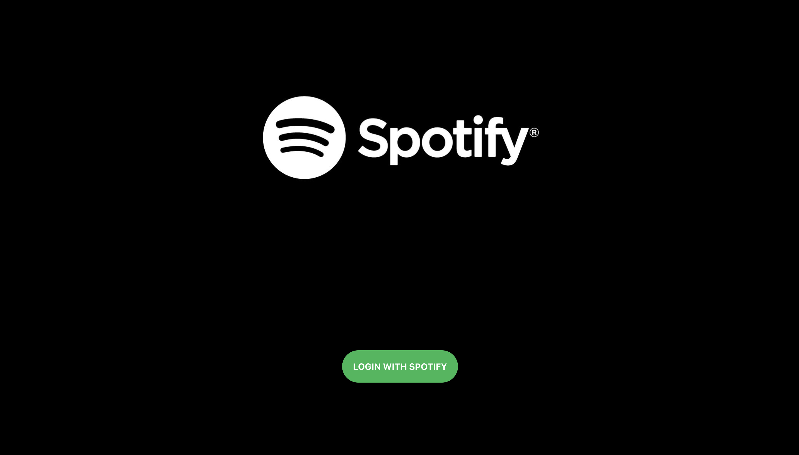
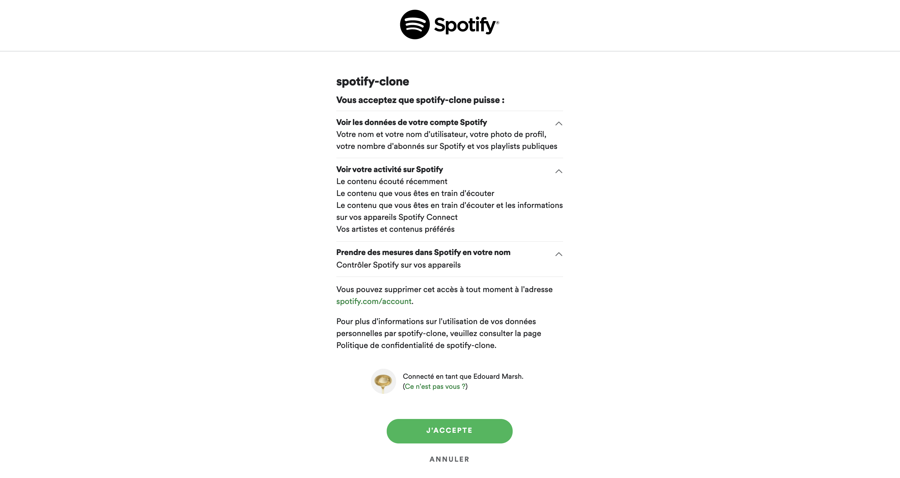
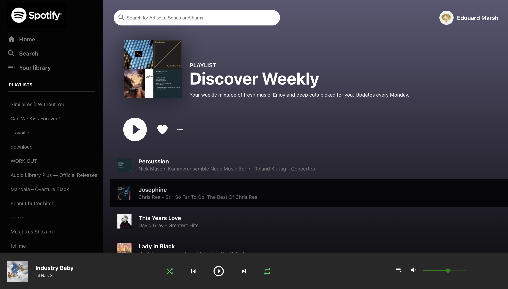

<h1> Spotify Clone 🎶 </h1>
I created a Spotify clone with React Js and the Spotify Api ! 
 
 

<h3>Differents concept i used for the app  🧠</h3>
<ul>
  <li>React JS </li>
  <li>Spotify Api</li>
  <li>Context API (REDUX)</li>
  <li>Material UI</li>
  <li>Flexbox (css)</li>
</ul>

 

<h3> ⚠️ Important ⚠️  </h3>
First you need to writte your clientId in spotify.js line 5.  
const clientId = ""; 
You can find your clientId in your Dashboard on <a href="https://developer.spotify.com/">Spotify for developers.</a> 

 
 
 

## How to launch ? 🚀

This project was bootstrapped with [Create React App](https://github.com/facebook/create-react-app).

<h3>Available Scripts </h3>

In the project directory, you can run:

### `yarn start`

Runs the app in the development mode.\
Open [http://localhost:3000](http://localhost:3000) to view it in the browser.
 
 

<h1>Login page </h1>

<h1>Authorisation page </h1>

<h1>Main page </h1>

